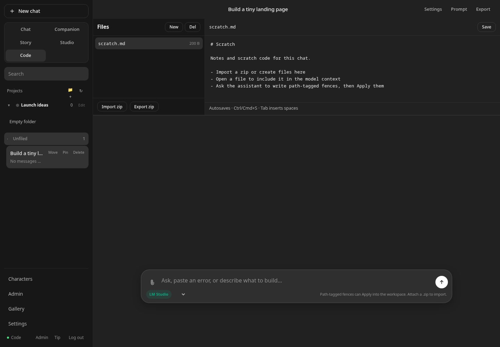
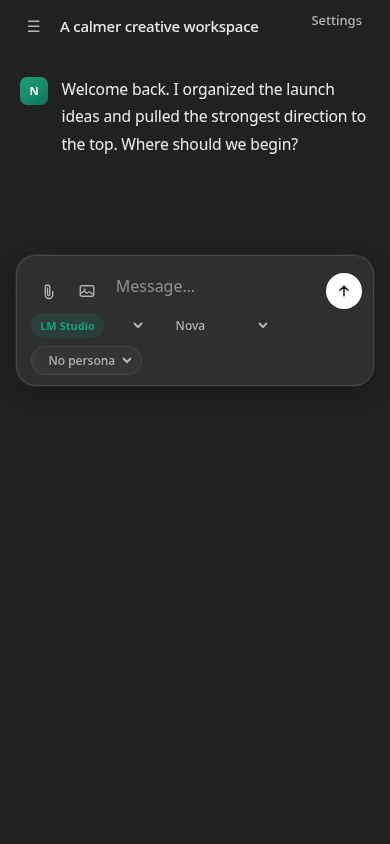

# Personal WebUI

[](https://github.com/Pedregoneric/personal-webui/actions/workflows/test.yml)
[](https://nodejs.org/)
[](LICENSE)
[](package.json)

Free, self-hosted **personal chat** for local and OpenAI-compatible cloud models. Characters, personas, prompt presets, folders, image/file gallery, themes, and chat settings — on **your** machine.

**Free forever.** No paid tier, no feature unlocks. Optional one-time tips via [agentmediatools.com/tip](https://agentmediatools.com/tip) if it helps.

Sibling to [Grok WebUI](https://github.com/Pedregoneric/grok-webui) and [Codex WebUI](https://github.com/Pedregoneric/codex-webui) from Agent Media Tools — same privacy model, different job (personal chat + light Code mode, not shell agents).


<table>
  <tr>
    <td width="70%"><strong>Code mode</strong></td>
    <td width="30%"><strong>Mobile</strong></td>
  </tr>
  <tr>
    <td><a href="docs/screenshots/personal-webui-code.png"></a></td>
    <td><a href="docs/screenshots/personal-webui-mobile.png"></a></td>
  </tr>
</table>

**[Product page](https://agentmediatools.com/personal-webui)** · **[All free downloads](https://agentmediatools.com/free)** · **[Optional tip](https://agentmediatools.com/tip?from=personal-webui)**

## Quick start

Prerequisite: [Node.js 20 or newer](https://nodejs.org/).

```bash
git clone https://github.com/Pedregoneric/personal-webui.git
cd personal-webui
cp .env.example .env
npm start
```

Open **http://127.0.0.1:4547**, create the first admin account, then add an
OpenAI-compatible model in **Settings → Models**. No `npm install` step is
needed: the app has zero runtime dependencies.

> [!IMPORTANT]
> Keep the default localhost bind, or use a private Tailscale address. Personal
> WebUI is intended for a trusted personal or household network—not the open
> internet.

## Features (v0.1)

- Multi-chat history with **pin / delete** on the sidebar, plus search
- Streaming chat via OpenAI-compatible APIs (DeepSeek default)
- Modes: **Chat**, **Companion**, **Story**, **Studio**, **Code**
- **Code mode** — per-chat file workspace, copyable fences, Apply path-tagged files, zip import/export (pair-program packs; not an agent shell)
- **Folders** — group chats; optional folder system/style prompts and default model/sampling/preset (**inherit with chat override**)
- Message actions: **Copy** / **Regenerate** / **Branch** (branch clones the thread up through that reply)
- **Characters** (system prompt, personality, scenario, first message, examples)
- **User personas** (who you are in the chat)
- **Prompt presets** (system/style + generation defaults)
- Temperature / top_p / max tokens per chat
- Image & file gallery (upload, browse; stays local)
- Themes, accents, density, chat width, font scale, custom CSS
- Prompt preview (exact messages that would be sent)
- Markdown export
- Password-protected UI, Tailscale-friendly bind
- Optional tip link (does not unlock features)

### Modes

| Mode | Role |
|------|------|
| **Chat** | Clean conversation |
| **Companion** | Character-first presence |
| **Story** | Scene / narrative notes |
| **Studio** | Creative / image-oriented layout |
| **Code** | Per-chat sandbox workspace + zip packs |

### Folders

Chats can sit in a flat folder (or stay unfiled). A folder may set `systemPrompt`, `stylePrompt`, and defaults for model / temperature / top_p / max tokens / preset. **Null folder fields inherit** from mode/settings; **chat fields override** folder when set. New chats inherit the active sidebar folder. Collapse/expand folders in the list; edit folder settings from the folder header.

### Message & sidebar actions

- On assistant replies: **Copy**, **Regenerate** (truncate from that message and re-stream), **Branch** (new chat cloned through that message, same folder/mode/settings).
- On each sidebar thread: **Pin** / **Unpin**, **Delete** (with confirm), **Move** into a folder.

### Multi-user & admin

- Accounts live in `data/users.json` with durable sessions in `data/sessions.json`.
- Each user gets an isolated tree under `data/users/{userId}/` (chats, folders, library, settings, workspaces, media).
- **First account from `.env`** (`WEBUI_USERNAME` + password salt/hash) becomes **admin** on boot migration; first-visit browser setup also creates an admin.
- **Open signup defaults to off** (`app.signupEnabled`). Admins can create users and optionally enable signup.
- **Admin area** at [`/admin`](/admin) — manage users (role, disable, reset password), signup toggle, brand title, tip URL. Admins do **not** browse other users’ chats.

This remains a **trusted personal / small-household tool** on Tailscale or localhost — not public multi-tenant SaaS. Do not port-forward it to the open internet.

### Code mode vs Codex / Grok WebUI

| | Personal WebUI **Code** | Codex / Grok WebUI |
|--|-------------------------|--------------------|
| Job | Pair-program in chat + zip packs | Agentic coding with shell/tools |
| Files | Per-chat sandbox under `data/users/…/workspaces/` | Real project workspace on disk |
| AI edits | Path-tagged fences → **Apply** | Tool loops / patches |
| Zip | Import / export project packs | Upload as attachments |
| Agents | None — you drive the chat | Shell / tool agents run commands |

Stay on Codex/Grok WebUI when you need the model to run commands. Use Personal **Code** when you want a private chat that co-writes files and ships a zip.

## Security model

- Bind to Tailscale IP or localhost — not `0.0.0.0` on a public network
- Username + scrypt-hashed password; API keys only in server `.env`
- Sessions: random `HttpOnly`, `SameSite=Strict` cookies
- Browser hardening headers on every response; session cookies become `Secure` automatically behind an HTTPS proxy
- State-changing requests require same origin
- Admin routes return **403** for non-admins; signup returns **403** when disabled

## Configuration

The browser setup flow is the simplest option. For unattended installs, you can
also preconfigure a model and the initial admin credentials in `.env`.

```bash
cp .env.example .env
# Keep HOST=127.0.0.1 for local-only access.
# Add a provider key below, or configure models later in Settings → Models.
npm start
```

Default port: **4547**.

Useful deployment options:

```env
# Force Secure session cookies when TLS terminates somewhere that does not
# forward X-Forwarded-Proto: https.
COOKIE_SECURE=true

# Optional alternate env file (useful for services, tests, or parallel installs).
PERSONAL_WEBUI_ENV_FILE=/path/to/personal-webui.env
```

On boot the server runs an **idempotent migration**: if legacy flat `data/` chats/settings/library exist (or `.env` credentials are present and no users yet), they move into the admin user’s namespace under `data/users/{id}/`. Re-running start is safe — already-migrated installs are skipped.

### Model providers

Personal WebUI talks to OpenAI-compatible APIs. Provider details and secrets
stay on the server, never in browser storage.

| Provider | Example base URL | API key |
|---|---|---|
| LM Studio | `http://127.0.0.1:1234/v1` | Usually not required |
| Ollama | `http://127.0.0.1:11434/v1` | Usually not required |
| DeepSeek | `https://api.deepseek.com/v1` | Required |
| OpenAI-compatible cloud | Provider-specific `/v1` URL | Usually required |

Example DeepSeek seed configuration:

```env
DEEPSEEK_API_KEY=sk-...
DEEPSEEK_BASE_URL=https://api.deepseek.com/v1
DEFAULT_MODEL=deepseek-chat
```

You can add or change providers later in **Settings → Models**.

## Data and backups

Chats, accounts, settings, media, and Code workspaces live under `data/`, which
is ignored by Git. Back up that directory and your `.env` file before upgrades.
Never commit either one. Updating the app does not intentionally remove user
data, and the startup migration is idempotent.

## Development

```bash
npm start
npm run check
npm test
```

Zero npm dependencies. Tests use Node’s built-in `node:test` only.

## License

MIT
